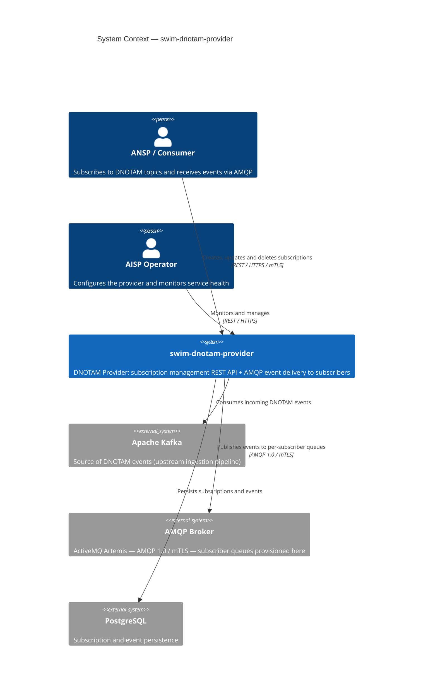
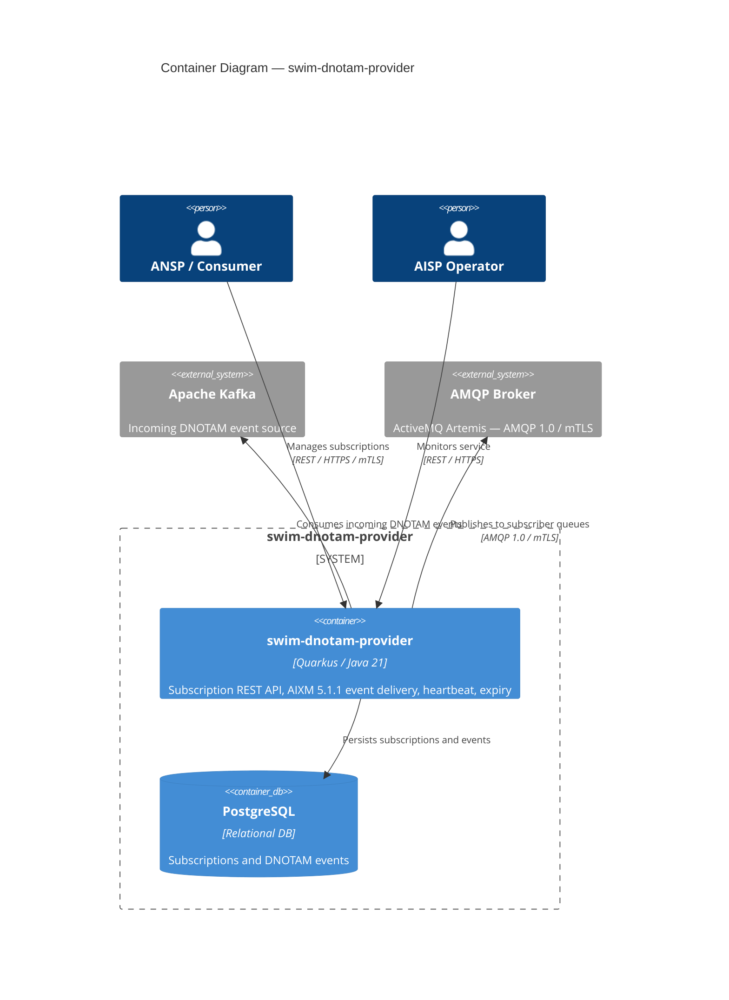
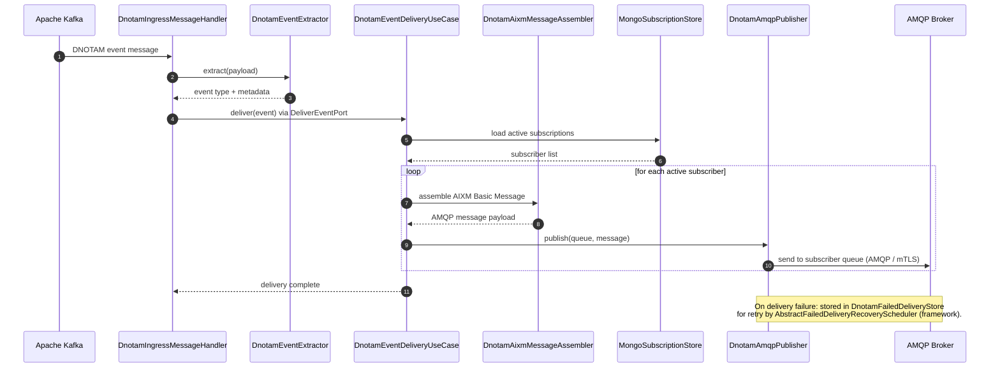

# swim-dnotam-provider — Architecture

> Diagrams use [Mermaid](https://mermaid.js.org) and render natively on GitHub.

**Role**: AISP (Aeronautical Information Service Provider) — exposes a DNOTAM subscription REST API, receives DNOTAM events from Kafka, validates and assembles AIXM 5.1.1 payloads, and delivers them to subscriber AMQP queues.

---

## 1. System Context (C4 Level 1)

---

## 2. Container Diagram (C4 Level 2)

---

## 3. Component Diagram (C4 Level 3)

```mermaid
C4Component
    title Component Diagram — swim-dnotam-provider

    System_Ext(kafka, "Apache Kafka")
    System_Ext(broker, "AMQP Broker")
    System_Ext(postgres, "PostgreSQL")

    Container_Boundary(provider, "swim-dnotam-provider") {
        Component(subColRes, "SubscriptionCollectionResource", "JAX-RS", "REST — subscription creation and listing")
        Component(subItemRes, "SubscriptionItemResource", "JAX-RS", "REST — subscription update and deletion")
        Component(featureRes, "FeatureResource", "JAX-RS", "WFS GetFeature endpoint — queries persisted DNOTAM events")
        Component(topicRes, "TopicResource", "JAX-RS", "REST — topic listing")

        Component(ingressHandler, "DnotamIngressMessageHandler", "SmallRye Messaging", "Kafka consumer — receives events, delegates to delivery use case")

        Component(subUC, "DnotamSubscriptionUseCase", "CDI", "Subscriber registration, queue provisioning, update, deletion")
        Component(deliveryUC, "DnotamEventDeliveryUseCase", "CDI", "Fan-out: delivers event to all active subscriber AMQP queues")
        Component(queryUC, "DnotamEventQueryUseCase", "CDI", "WFS query over persisted events — OGC filter parsing")

        Component(amqpPublisher, "DnotamAmqpPublisher", "Qpid JMS / SwimAmqpPublisherPort SPI", "Sends AMQP messages to individual subscriber queues")
        Component(heartbeat, "DnotamHeartbeatPublisher", "Quartz", "Publishes heartbeat messages to subscriber queues")
        Component(expiry, "DnotamExpiryStrategy", "Quartz / SubscriptionExpiryStrategy SPI", "Marks subscriptions as expired when TTL is exceeded")

        Component(assembler, "DnotamAixmMessageAssembler", "CDI / AixmMessageAssemblerPort SPI", "Assembles AIXM 5.1.1 Basic Message for delivery")
        Component(extractor, "DnotamEventExtractor", "CDI / SwimEventExtractor SPI", "Extracts event type and metadata from AIXM payload")
        Component(jaxbPool, "DnotamJaxbUnmarshallerPool", "JAXB", "Thread-safe pool of JAXB unmarshallers for AIXM 5.1.1 XML")

        Component(mongoSub, "MongoSubscriptionStore", "Panache / SubscriptionStore port/out", "Subscriber persistence")
        Component(evtStore, "DnotamEventStore", "Panache / EventStore port/out", "DNOTAM event persistence")
        Component(failedStore, "DnotamFailedDeliveryStore", "Panache / SwimFailedDeliveryStorePort SPI", "Failed delivery persistence for retry")
    }

    Rel(subColRes, subUC, "calls via", "ManageSubscriptionPort")
    Rel(subItemRes, subUC, "calls via", "ManageSubscriptionPort")
    Rel(featureRes, queryUC, "calls via", "QueryEventPort")
    Rel(ingressHandler, extractor, "extracts metadata with")
    Rel(ingressHandler, deliveryUC, "delegates to via", "DeliverEventPort")
    Rel(deliveryUC, assembler, "assembles payload with")
    Rel(deliveryUC, amqpPublisher, "publishes via", "SwimAmqpPublisherPort")
    Rel(deliveryUC, mongoSub, "reads active subscribers via", "SubscriptionStore port")
    Rel(deliveryUC, evtStore, "persists events via", "EventStore port")
    Rel(deliveryUC, failedStore, "stores failures via", "SwimFailedDeliveryStorePort")
    Rel(heartbeat, amqpPublisher, "sends heartbeats via", "SwimAmqpPublisherPort")
    Rel(expiry, subUC, "expires subscriptions")

    Rel(ingressHandler, kafka, "consumes from")
    Rel(amqpPublisher, broker, "publishes to", "AMQP 1.0 / mTLS")
    Rel(mongoSub, postgres, "persists to")
    Rel(evtStore, postgres, "persists to")
    Rel(failedStore, postgres, "persists to")
```

---

## 4. Event Delivery — Sequence

