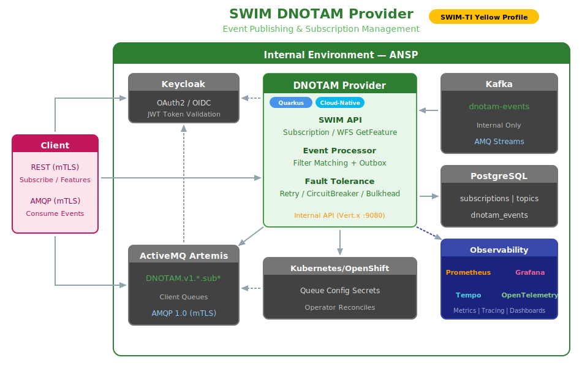
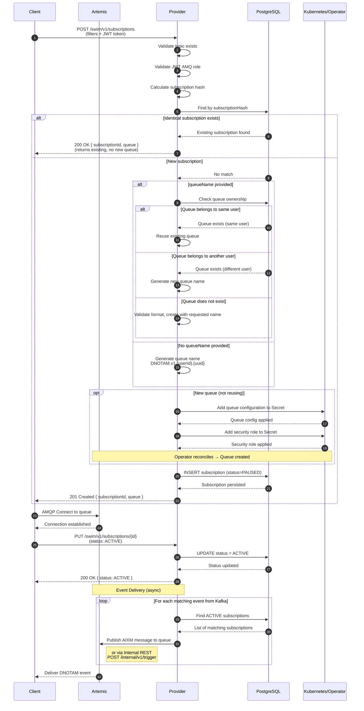

# SWIM DNOTAM Provider

> ⚠️ **Code Under Review**: Source code is currently under internal review and will be available soon.

AISP-role service for publishing Digital NOTAM events to subscribers via SWIM infrastructure.

## What It Does

The Provider implements the SWIM Subscription Manager API, manages subscriber queues in Artemis, consumes events from Kafka, and delivers them to subscribed consumers via AMQP.



**Capabilities:**
- SWIM Subscription Manager API (ED-254)
- WFS GetFeature endpoint
- Dynamic queue management (Artemis JMX)
- Kafka event consumption
- AMQP event delivery (Outbox pattern)
- JWT/OIDC authentication (Keycloak)
- mTLS for external consumers
- PostgreSQL persistence
- Distributed tracing (OpenTelemetry)

## Quick Start

### Using the Operator (Recommended)

```yaml
apiVersion: apps.swim-developer.github.io/v1alpha1
kind: SwimDigitalNotamProvider
metadata:
  name: dnotam-provider
spec:
  certManager:
    issuerName: swim-ca-issuer
    issuerKind: ClusterIssuer
  artemis:
    acceptors:
      verifyHost: false
    oidc:
      authServerUrl: 'https://rhbk.apps.ocp4.masales.cloud/'
      realm: swim
      clientId: amq-broker
      clientSecret: Is9wwNhgH4EQTDSmpT5Oa9XHSp73QlrA
  provider:
    consumeFromClientTopics: true
    observability:
      otelEndpoint: 'http://tempo-simplest-distributor.tempostack.svc.cluster.local:4317'
    oidc:
      authServerUrl: 'https://rhbk.apps.ocp4.masales.cloud/realms/swim'
      clientId: 'swim-dnotam-provider'
      clientSecret: 'L3wFbBGpRtHzfkLj0ntMB7Q9DQx8Idvc'
```

### Container Image

`podman pull quay.io/masales/swim-dnotam-provider:latest`

## API Endpoints

| Method | Endpoint | Description |
|--------|----------|-------------|
| `POST` | `/swim/v1/subscriptions` | Create subscription (returns queue name) |
| `GET` | `/swim/v1/subscriptions` | List subscriptions |
| `GET` | `/swim/v1/subscriptions/{id}` | Get subscription details |
| `PUT` | `/swim/v1/subscriptions/{id}` | Update status (ACTIVE/PAUSED) |
| `DELETE` | `/swim/v1/subscriptions/{id}` | Delete subscription |
| `GET` | `/swim/v1/topics` | List available topics |
| `GET` | `/swim/v1/features` | WFS GetFeature (AIXM) |
| `GET` | `/swim/v1/subscriptions/ping` | Health check (public) |

**Swagger UI:** `<SERVER_URL>/swagger-ui`

### Internal API (Vert.x)

A separate Vert.x HTTP server runs on port `9080` for internal cluster operations:

| Endpoint | Method | Description |
|----------|--------|-------------|
| `/internal/v1/trigger` | POST | Inject AIXM events directly (bypasses Kafka) |
| `/internal/v1/openapi.yaml` | GET | OpenAPI specification for internal endpoints |

This API is **not exposed externally** and is intended for administrative operations, testing, or direct event injection from other cluster services.

| Variable | Default | Description |
|----------|---------|-------------|
| `INTERNAL_SERVER_PORT` | `9080` | Internal API server port |

## Environment Variables

### PostgreSQL

| Variable | Default | Description |
|----------|---------|-------------|
| `POSTGRES_HOST` | `provider-postgres.swim-demo.svc.cluster.local` | PostgreSQL host |
| `POSTGRES_PORT` | `5432` | PostgreSQL port |
| `POSTGRES_DB` | `swim-dnotam` | Database name |
| `POSTGRES_USER` | `swim-provider` | Database user |
| `POSTGRES_PASSWORD` | `swim-provider` | Database password |

### AMQP Broker (Artemis)

| Variable | Default | Description |
|----------|---------|-------------|
| `AMQP_HOST` | `provider-artemis-hdls-svc` | Artemis broker host |
| `AMQP_PORT` | `5672` | AMQP port |
| `AMQP_USERNAME` | `admin` | AMQP username |
| `AMQP_PASSWORD` | `admin` | AMQP password |
| `ARTEMIS_BROKER_NAME` | `provider-artemis` | Broker name for JMX |
| `ARTEMIS_JMX_URL` | *(service URL)* | JMX URL for queue management |

### Kafka

| Variable | Default | Description |
|----------|---------|-------------|
| `KAFKA_BOOTSTRAP_SERVERS` | `kafka-kafka-bootstrap:9092` | Kafka bootstrap servers |
| `KAFKA_TOPIC` | `dnotam-events-all-topic` | Topic to consume events from |
| `KAFKA_GROUP_ID` | `swim-dnotam-provider` | Consumer group ID |
| `KAFKA_PATTERN` | `false` | Use topic pattern matching |
| `KAFKA_MAX_POLL_RECORDS` | `50` | Max records per poll |
| `KAFKA_REQUESTS` | `100` | Max concurrent requests |

### OIDC/Keycloak

| Variable | Default | Description |
|----------|---------|-------------|
| `OIDC_ENABLED` | `true` | Enable OIDC authentication |
| `OIDC_AUTH_SERVER_URL` | `https://rhbk.apps.ocp4.masales.cloud/realms/swim` | Keycloak realm URL |
| `OIDC_CLIENT_ID` | `swim-dnotam-provider` | OIDC client ID |
| `OIDC_CLIENT_SECRET` | *(secret)* | OIDC client secret |

### SSL/TLS Certificates

| Variable | Default | Description |
|----------|---------|-------------|
| `QUARKUS_HTTP_SSL_CERTIFICATE_FILES` | `/certs/server/tls.crt` | Server certificate |
| `QUARKUS_HTTP_SSL_CERTIFICATE_KEY_FILES` | `/certs/server/tls.key` | Server private key |
| `QUARKUS_HTTP_SSL_CERTIFICATE_TRUST_STORE_FILE` | `/certs/ca/ca.crt` | CA truststore |

### SWIM Configuration

| Variable | Default | Description |
|----------|---------|-------------|
| `SWIM_DNOTAM_VERSION` | `1.0` | Service version |
| `SWIM_TOPICS` | `DigitalNOTAMService` | Available topics |
| `KUBERNETES_NAMESPACE` | `swim-demo` | Kubernetes namespace |
| `K8S_SECRET_ADDRESS` | `address-swim-configurations-bp` | Secret for address config |
| `K8S_SECRET_SECURITY` | `security-swim-roles-bp` | Secret for security roles |

### Observability

| Variable | Default | Description |
|----------|---------|-------------|
| `OTEL_ENABLED` | `true` | Enable OpenTelemetry |
| `OTEL_SDK_DISABLED` | `false` | Disable OTLP SDK |
| `OTEL_ENDPOINT` | `http://localhost:4317` | OTLP collector endpoint |
| `PROMETHEUS_ENABLED` | `true` | Enable Prometheus metrics |

### HTTP

| Variable | Default | Description |
|----------|---------|-------------|
| `QUARKUS_HTTP_PORT` | `8080` | HTTP port |
| `OPENAPI_SERVERS` | *(none)* | OpenAPI server URLs |
| `LOG_LEVEL` | `INFO` | Log level |

## Health Checks (administrative port 9000 - no external routes to them)

| Endpoint | Purpose |
|----------|---------|
| `/q/health/live` | Liveness probe |
| `/q/health/ready` | Readiness probe |
| `/swim/v1/subscriptions/ping` | API health (public) |

## Subscription Flow



| Scenario | Behavior |
|----------|----------|
| **Identical subscription** | If request matches an existing ACTIVE/PAUSED subscription (same filters, user), returns the existing subscription without creating a new queue |
| **Queue name provided (same user)** | Reuses the existing queue, allowing multiple subscriptions to deliver to a single queue |
| **Queue name provided (different user)** | Security protection: ignores requested name and generates a new queue |
| **No queue name** | Generates unique queue: `DNOTAM.v1.{userId}.{uuid}` |

### Event Delivery

Events are delivered to matching ACTIVE subscriptions via:
- **AMQP**: Published directly to Artemis queues
- **Internal REST**: `POST /internal/v1/trigger` for administrative injection

## Technology Stack

| Component | Technology |
|-----------|------------|
| Runtime | Quarkus (Native/JVM) |
| Persistence | PostgreSQL |
| Broker | ActiveMQ Artemis |
| Streaming | Apache Kafka |
| Security | mTLS + JWT/OIDC (Keycloak) |
| Queue Mgmt | JMX (Artemis) |
| Tracing | OpenTelemetry |
| Metrics | Prometheus |

## Standards Alignment

| Standard | Description | Status |
|----------|-------------|--------|
| EUROCONTROL SPEC-170 | SWIM-TI Yellow Profile | ✅ Implemented, ⏳ Pending Validation |
| EUROCAE ED-254 | Service Interface Bindings | ✅ Implemented, ⏳ Pending Validation |
| EU Regulation 2021/116 | Common Project One (CP1) | ✅ Implemented, ⏳ Pending Validation |
| AIXM 5.1.1 | Aeronautical Information Exchange Model | ✅ Implemented |

## License

BSD 3-Clause License

---

Part of the [swim-developer](https://swim-developer.github.io) initiative.
