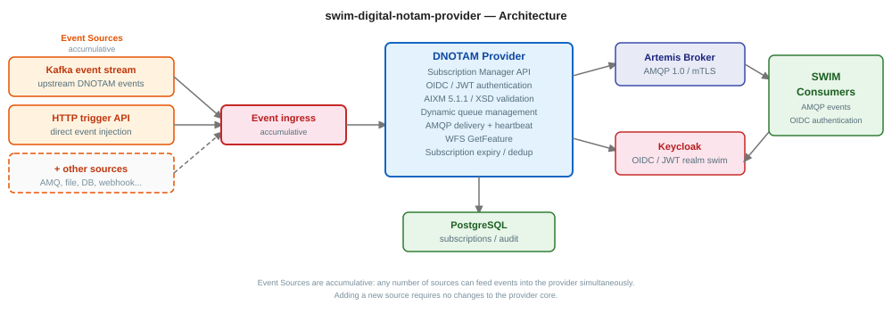

# swim-digital-notam-provider

AISP-role service for publishing Digital NOTAM events to subscribers via SWIM infrastructure. Implements the SWIM Subscription Manager API, manages subscriber queues in ActiveMQ Artemis, consumes events from Kafka, and delivers them to subscribed consumers via AMQP 1.0 over TLS.



## What it does

- **Subscription Manager API**, SPEC-170 compliant REST endpoints with JWT/OIDC authentication (Keycloak)
- **Dynamic queue management**, creates and removes Artemis queues via Kubernetes Secrets and JMX
- **Kafka event consumption**, receives DNOTAM events from upstream Kafka topics
- **AMQP event delivery**, publishes AIXM messages to subscriber queues with outbox pattern and fault tolerance
- **WFS GetFeature**, OGC-compliant endpoint for querying AIXM features
- **Subscription deduplication**, hash-based detection of identical subscriptions, queue reuse for same user
- **Subscription expiry**, configurable TTL with automatic purge of expired subscriptions
- **Heartbeat publishing**, periodic heartbeats to subscription heartbeat queues
- **Internal API**, separate Vert.x HTTP server (port 9080) for administrative event injection
- **Observability**, OpenTelemetry tracing, Prometheus metrics, structured logging
- **mTLS**, mutual TLS for external consumer connections

---

## GET STARTED

### Prerequisites

- Java 21+
- Maven 3.9+
- [Podman Desktop](https://podman-desktop.io), includes the Podman engine and a graphical interface for managing containers and compose stacks. Any OCI-compatible runtime with Compose support also works.
- [mkcert](https://github.com/FiloSottile/mkcert), local certificate authority

  **macOS**
  ```bash
  brew install mkcert
  ```

  **Fedora / RHEL**
  ```bash
  sudo dnf install nss-tools
  curl -Lo mkcert https://dl.filippo.io/mkcert/latest?for=linux/amd64
  chmod +x mkcert
  sudo mv mkcert /usr/local/bin/
  ```

  **Debian / Ubuntu**
  ```bash
  sudo apt install libnss3-tools
  curl -Lo mkcert https://dl.filippo.io/mkcert/latest?for=linux/amd64
  chmod +x mkcert
  sudo mv mkcert /usr/local/bin/
  ```

  **Linux (Homebrew)**
  ```bash
  brew install mkcert
  ```

  **Windows (Chocolatey)**
  ```powershell
  choco install mkcert
  choco install openssl
  ```

  **Windows (Scoop)**
  ```powershell
  scoop bucket add extras
  scoop install mkcert
  scoop install openssl
  ```

  > On Windows, `openssl` is also bundled with Git for Windows and is usually already on the PATH.

- `/etc/hosts` entry for `keycloak.swim.lab` — required so the browser can follow OIDC redirects and so the Artemis broker can resolve Keycloak by name for JWT validation. The local Keycloak certificate is issued for `keycloak.swim.lab` and that hostname must resolve to `127.0.0.1`.

  **macOS**
  ```bash
  sudo sh -c 'echo "127.0.0.1  keycloak.swim.lab" >> /etc/hosts'
  ```

  **Linux**
  ```bash
  echo "127.0.0.1  keycloak.swim.lab" | sudo tee -a /etc/hosts
  ```

  **Windows** — open `C:\Windows\System32\drivers\etc\hosts` as Administrator and add:
  ```
  127.0.0.1  keycloak.swim.lab
  ```

  Or from an elevated PowerShell:
  ```powershell
  Add-Content -Path "C:\Windows\System32\drivers\etc\hosts" -Value "127.0.0.1  keycloak.swim.lab"
  ```

  To verify: `ping keycloak.swim.lab` should respond from `127.0.0.1`.

### 0. Generate local certificates

This project is self-contained. All certificates are generated locally with no external dependency.

**macOS / Linux**
```bash
./certs/generate.sh
```

**Windows (PowerShell)**
```powershell
.\certs\generate.ps1
```

This is a one-time step per machine. It uses `mkcert` to create a local CA (installed into your system trust store), then generates:

- `certs/broker.p12`: Artemis broker keystore, mounted into the Artemis container
- `certs/ca-truststore.p12`: CA truststore for Artemis, used to verify incoming consumer client certs
- `certs/keycloak-keystore.p12`: Keycloak HTTPS keystore, mounted into the Keycloak container
- `certs/tls.crt` / `certs/tls.key`: provider HTTPS server certificate (Quarkus TLS)
- `certs/client.crt` / `certs/client.key`: provider AMQP client certificate (mTLS to Artemis)

The broker certificate covers `localhost`, `127.0.0.1`, `dnotam-provider-artemis.swim.lab`, and `nip.io` variants. The Keycloak certificate covers `keycloak.swim.lab` and `localhost`.

### 0.5 Add-ons

The local Artemis broker and Keycloak instance require two JAR files from [swim-developer-add-ons](https://github.com/swim-developer/swim-developer-add-ons). Pre-built JARs are already committed at `src/local-dev/add-ons/` so `podman compose up` works immediately after `git clone`.

| JAR | Loaded by | Purpose |
|-----|-----------|---------|
| `activemq-log-plugin.jar` | Artemis broker | Intercepts message ACKs on SWIM subscription queues and publishes structured delivery audit records to an internal `ACK_MONITOR` topic — broker-level proof of delivery for CP1 audit |
| `keycloak-swim-role-spi.jar` | Keycloak | Creates per-user AMQP client roles in the `amq-broker` Keycloak client on user registration, so each subscriber's JWT carries the role that grants queue access in Artemis |

To update the JARs to a newer version, clone [swim-developer-add-ons](https://github.com/swim-developer/swim-developer-add-ons), build the module you need, and copy the output JAR to `src/local-dev/add-ons/`:

```
activemq-log-plugins/target/activemq-log-plugin.jar
  → src/local-dev/add-ons/activemq-log-plugin.jar

keycloak-swim-role-spi/target/keycloak-swim-role-spi-*.jar
  → src/local-dev/add-ons/keycloak-swim-role-spi.jar
```

See `src/local-dev/add-ons/README.md` for the full update procedure.

### 1. Start the local infrastructure

The local Artemis and Keycloak containers use Red Hat images hosted on `registry.redhat.io`:

| Image | Product |
|-------|---------|
| `registry.redhat.io/amq7/amq-broker-rhel9:7.13` | Red Hat AMQ Broker 7.13 |
| `registry.redhat.io/rhbk/keycloak-rhel9:26.4-10` | Red Hat Build of Keycloak 26.4 |

**Subscription requirement**: a [Red Hat Developer](https://developers.redhat.com) account is sufficient — it is free and grants access to all Red Hat products for development purposes. No paid subscription is required to pull these images for local development. For production deployments an enterprise subscription is required.

Before building for the first time, authenticate with the Red Hat registry using your Red Hat Developer account:

```bash
podman login registry.redhat.io
```

Then build and start all services:

```bash
podman compose up --build -d
```

The `--build` flag is needed on the first run, after changes to `src/local-dev/artemis/`, and after regenerating certificates (`./certs/generate.sh`), since the mkcert CA is imported into the Artemis JVM truststore at build time.

Subsequent runs (no cert changes):

```bash
podman compose up -d
```

> **Tip:** [Quarkus Dev Services](https://quarkus.io/guides/dev-services) can also provision databases and brokers automatically during `./mvnw quarkus:dev`, as an alternative to the `compose.yml`.

Services started:

| Service | Port | Description |
|---------|------|-------------|
| `dnotam-provider-artemis` | 5671 (AMQPS/mTLS), 5672 (AMQP), 8161 | AMQP broker (Artemis) |
| `dnotam-provider-postgres` | 5432 | Subscription database |
| `kafka` | 9092 | Kafka broker (KRaft) |
| `dnotam-provider-akhq` | 9090 | Kafka web UI |
| `keycloak` | 8543 | OIDC authentication |
| `keycloak-postgres` | 5433 | Keycloak database |
| `dnotam-provider-validator` | 8085 | SWIM consumer test harness |
| `dnotam-provider-validator-db` | 3308 | Validator persistence (MariaDB) |

Useful URLs:

- Artemis console: http://localhost:8161 (admin / admin)
- Kafka UI (AKHQ): http://localhost:9090
- Keycloak admin: https://localhost:8543 (admin / password)
- Provider validator UI: http://localhost:8085/ui

#### Keycloak users

All users belong to the `swim` realm. Password for every user is `password`.

| Username | Email | AMQ Broker roles |
|----------|-------|-----------------|
| `marcelo` | masales@redhat.com | `marcelo-swim-dnotam-v1-amq-role`, `marcelo-swim-ed254-v1-amq-role`, `admin` |
| `daniel` | daniel@swim.local | `daniel-swim-dnotam-v1-amq-role`, `daniel-swim-ed254-v1-amq-role` |
| `ansp1` | ansp1@swim.local | `ansp1-swim-dnotam-v1-amq-role`, `ansp1-swim-ed254-v1-amq-role` |
| `ansp2` | ansp2@swim.local | `ansp2-swim-dnotam-v1-amq-role`, `ansp2-swim-ed254-v1-amq-role` |
| `aisp1` | aisp1@swim.local | `aisp1-swim-dnotam-v1-amq-role`, `aisp1-swim-ed254-v1-amq-role` |

Each user receives DNOTAM events on their own dedicated queue (`DNOTAM-{username}-*`). Use any of these users to log in to the Provider Validator UI at http://localhost:8085/ui.

#### About the provider validator

The `dnotam-provider-validator` simulates a real external SWIM subscriber. It authenticates via Keycloak (OIDC), creates subscriptions through the provider's Subscription Manager REST API (HTTPS/mTLS), connects to the Artemis broker via **AMQPS on port 5671** using **mTLS** and a **Keycloak JWT token**, and displays received DNOTAM events on an interactive Europe map.

**Security model**: the validator authenticates with Keycloak via browser OIDC login and obtains a JWT token. It connects to Artemis with mTLS (transport security, `validator-keystore.p12`) and presents the JWT as the AMQP SASL PLAIN password. The Artemis JAAS chain validates the token against Keycloak (`BearerTokenLoginModule`) and maps the token's `amq-broker` client roles to Artemis roles. The `keycloak-swim-role-spi` ensures the user's token carries the correct role granting queue access.

The compose uses the pre-built image `quay.io/masales/swim-dnotam-provider-validator:latest`. It connects to:

- The provider REST API running on your machine at `https://host.containers.internal:8443` (mTLS)
- The Artemis broker via AMQPS on port 5671 with the `validator-keystore.p12` client certificate and a Keycloak JWT token
- Keycloak at `https://keycloak.swim.lab:8543` for browser-side OIDC login

On macOS, `host.containers.internal` resolves to the host automatically. On Linux with Podman, also add `127.0.0.1 host.containers.internal` to `/etc/hosts` (see Prerequisites above for the full list including `keycloak.swim.lab`).

To run the provider without starting the validator (provider-only development):

```bash
podman compose up -d --scale dnotam-provider-validator=0 --scale dnotam-provider-validator-db=0
```

To run the validator from source instead of the pre-built image, clone `swim-dnotam-provider-validator` and run:

```bash
./mvnw quarkus:dev
```

In dev mode (`application.properties %dev` profile), the validator uses `https://localhost:8443` for the provider REST API and `localhost:5671` for AMQP. Set `PROXY_MTLS_KEYSTORE_PATH` and `PROXY_MTLS_TRUSTSTORE_PATH` to point to the `certs/validator-keystore.p12` and `certs/validator-truststore.p12` generated by `./certs/generate.sh`.

### 2. Run the provider

```bash
./mvnw quarkus:dev
```

Options useful during development:

```bash
./mvnw quarkus:dev -Ddebug=false -Dquarkus.http.host=0.0.0.0
```

Use `-Dquarkus.http.host=0.0.0.0` to expose the API on all interfaces (required if testing from another machine or container).

Endpoints available in dev mode:

- REST API: https://localhost:8443
- Swagger UI: https://localhost:8443/swagger-ui
- Internal API: http://localhost:9080
- Health: http://localhost:8080/q/health

### 3. AMQP connectivity

The provider connects to its own Artemis via mTLS on port 5671 by default (configured in `application-dev.properties`).

To switch to plain AMQP (port 5672, no TLS), override in your local properties:

```properties
amqp-port=5672
mp.messaging.outgoing.dnotam-amqp-out.use-ssl=false
```

### 4. Inject a test event

Use the internal API to publish a DNOTAM event directly (bypasses Kafka).

**curl**

```bash
curl -s -X POST http://localhost:9080/internal/v1/trigger \
  -H "Content-Type: application/xml" \
  --data-binary @src/test/resources/messages/runway-closure.xml | jq .
```

**Postman** — import `src/test/postman/SWIM-DNOTAM-Provider-Validator.postman_collection.json` and the `SWIM-Local` environment, then run request **01** or **02**.

Sample AIXM payloads are available in `src/test/resources/messages/`.

### 5. Happy path — end-to-end with the Provider Validator

This walkthrough goes from zero to a real DNOTAM event delivered to a subscriber. It uses the `dnotam-provider-validator` that ships in the compose stack and your terminal. Complete steps 1–2 first.

#### Step A — Open the validator UI

Open http://localhost:8085/ui in your browser.

#### Step B — Log in via Keycloak

Click **Login**. The browser redirects to `https://keycloak.swim.lab:8543`. Use:

| Field | Value |
|-------|-------|
| Username | `marcelo` |
| Password | `password` |

After login you are redirected back to the validator UI.

#### Step C — Create a subscription

In the validator UI, click **New Subscription** and fill in:

| Field | Value |
|-------|-------|
| Topic | `DigitalNOTAMService` |
| Event scenario | `RWY.CLS` |
| Airport | `EADH` |

Click **Subscribe**. The validator calls the provider's Subscription Manager API, which provisions a dedicated queue in Artemis and returns a queue name. Keep this tab open.

#### Step D — Confirm the subscription is active

```bash
curl -s http://localhost:9080/internal/v1/subscriptions/summary | jq .
```

You should see `"totalActive": 1` and the subscription details for `marcelo`.

#### Step E — Check the provider status

```bash
curl -s http://localhost:9080/internal/v1/status | jq .
```

Expected: `"status": "UP"`, `"leader": true`, `"subscriptions": { "active": 1 }`.

#### Step F — Inject a runway closure event

```bash
curl -s -X POST http://localhost:9080/internal/v1/trigger \
  -H "Content-Type: application/xml" \
  --data-binary @src/test/resources/messages/runway-closure.xml | jq .
```

Expected response:

```json
{
  "status": "accepted",
  "message": "Event accepted for processing",
  "timestamp": "..."
}
```

#### Step G — See the event arrive in the validator UI

Switch back to the browser. Within a few seconds the runway closure event appears on the map and in the events list. The provider has validated the AIXM message, persisted it, matched it to the active subscription, and delivered it to the subscriber's Artemis queue.

#### Troubleshooting

| Symptom | Check |
|---------|-------|
| Login redirects to `keycloak.swim.lab` but fails | Verify `/etc/hosts` has `127.0.0.1 keycloak.swim.lab` |
| Subscription fails with `401` | Provider is not running (`./mvnw quarkus:dev`) |
| Trigger returns `500` | Provider logs — XSD validation error in the AIXM payload |
| Event does not appear in validator | Validator logs (`podman compose logs dnotam-provider-validator`) — check AMQP connection |

---

## Postman testing

A ready-to-import Postman collection is available in `src/test/postman/`:

| File | Description |
|------|-------------|
| `SWIM-DNOTAM-Provider-Validator.postman_collection.json` | Triggers DNOTAM events against the Internal API (port 9080) |
| `SWIM-Local.postman_environment.json` | Local environment: `provider_internal_host=localhost`, `provider_internal_port=9080` |

### How to import

1. Open Postman → **Import** → select both files.
2. Select **SWIM Local** as the active environment.
3. Run requests in order: **01** (AD.LIM / EADD) and **02** (RWY.CLS / EGLL).

Each request includes an automatic test that asserts HTTP `202 Accepted`. All requests can also be executed with `curl` — see the examples in step 4 and step 5 above.

---

## API

| Method | Endpoint | Description |
|--------|----------|-------------|
| `POST` | `/swim/v1/subscriptions` | Create subscription (returns queue name) |
| `GET` | `/swim/v1/subscriptions` | List subscriptions |
| `GET` | `/swim/v1/subscriptions/{id}` | Get subscription details |
| `PUT` | `/swim/v1/subscriptions/{id}` | Update status (ACTIVE/PAUSED) |
| `DELETE` | `/swim/v1/subscriptions/{id}` | Delete subscription |
| `GET` | `/swim/v1/topics` | List available topics |
| `GET` | `/swim/v1/features` | WFS GetFeature (AIXM) |
| `GET` | `/swim/v1/subscriptions/ping` | Health check (public) |

Swagger UI available at `/swagger-ui`.

### Internal API (port 9080)

| Method | Endpoint | Description |
|--------|----------|-------------|
| `POST` | `/internal/v1/trigger` | Inject AIXM event directly (bypasses Kafka, delivers to active subscribers) |
| `POST` | `/internal/v1/validate` | Validate AIXM XML against XSD without distributing |
| `GET` | `/internal/v1/subscriptions/summary` | List active subscribers grouped by scenario and airport |
| `GET` | `/internal/v1/status` | Provider health: leader state, subscription counts, event metrics |
| `GET` | `/internal/v1/openapi.yaml` | OpenAPI specification |

---

## Environment variables

| Variable | Default | Description |
|----------|---------|-------------|
| `POSTGRES_HOST` | `provider-postgres.swim-demo.svc.cluster.local` | PostgreSQL host |
| `POSTGRES_PORT` | `5432` | PostgreSQL port |
| `POSTGRES_DB` | `swim-dnotam` | Database name |
| `POSTGRES_USER` | `swim-provider` | Database user |
| `POSTGRES_PASSWORD` | `swim-provider` | Database password |
| `AMQP_HOST` | `provider-artemis-hdls-svc` | Artemis broker host |
| `AMQP_PORT` | `5672` | AMQP port |
| `AMQP_USERNAME` | `admin` | AMQP username |
| `AMQP_PASSWORD` | `admin` | AMQP password |
| `ARTEMIS_BROKER_NAME` | `provider-artemis` | Broker name for JMX operations |
| `KAFKA_BOOTSTRAP_SERVERS` | `kafka-kafka-bootstrap:9092` | Kafka bootstrap servers |
| `KAFKA_TOPIC` | `dnotam-events-all-topic` | Kafka topic to consume events from |
| `KAFKA_GROUP_ID` | `swim-dnotam-provider` | Kafka consumer group ID |
| `OIDC_ENABLED` | `true` | Enable OIDC authentication on the REST API |
| `OIDC_CLIENT_ID` | `swim-dnotam-provider` | OIDC client ID |
| `SWIM_TOPICS` | `DigitalNOTAMService` | Comma-separated list of published topics |
| `SWIM_DNOTAM_VERSION` | `1.0` | Service version advertised on `/swim/v1/topics` |
| `KUBERNETES_NAMESPACE` | `swim-demo` | Namespace for reading Artemis config Secrets |
| `INTERNAL_SERVER_PORT` | `9080` | Port for the internal event injection API |
| `OTEL_ENABLED` | `true` | Enable OpenTelemetry tracing |
| `OTEL_ENDPOINT` | `http://localhost:4317` | OTLP collector endpoint |
| `PROMETHEUS_ENABLED` | `true` | Enable Prometheus metrics at `/q/metrics` |
| `QUARKUS_HTTP_SSL_CERTIFICATE_FILES` | `/certs/server/tls.crt` | Server certificate (HTTPS) |
| `QUARKUS_HTTP_SSL_CERTIFICATE_KEY_FILES` | `/certs/server/tls.key` | Server private key (HTTPS) |
| `QUARKUS_HTTP_SSL_CERTIFICATE_TRUST_STORE_FILE` | `/certs/ca/ca.crt` | CA for client certificate validation (mTLS) |

---

## Container images

Pre-built multi-arch images (linux/amd64 + linux/arm64):

```
quay.io/masales/swim-dnotam-provider:latest
```

Run with Podman (or any OCI runtime):

```bash
podman run -p 8080:8080 -p 8443:8443 -p 9080:9080 \
  -e POSTGRES_HOST=host \
  -e AMQP_HOST=host \
  -e KAFKA_BOOTSTRAP_SERVERS=host:9092 \
  -e OIDC_ENABLED=false \
  -v /path/to/certs:/certs \
  quay.io/masales/swim-dnotam-provider:latest
```

---

## Build

### From source

```bash
./mvnw clean package -DskipTests
```

### Container images

```bash
make jvm                 # JVM multi-arch image, build + push  (fastest)

make native-amd64        # Native amd64, build + push  (run on amd64 machine)
make native-arm64        # Native arm64, build + push  (run on arm64 machine)
make manifest            # Create multi-arch manifest from registry images
make push                # Push manifest to registry
```

Override registry or tag: `make jvm REGISTRY=quay.io/myorg TAG=v1.2.3`

---

## Health checks

| Endpoint | Description |
|----------|-------------|
| `/q/health/live` | Liveness probe |
| `/q/health/ready` | Readiness probe |
| `/swim/v1/subscriptions/ping` | API health (public, no auth) |

---

## Deployment

Helm chart in `src/main/helm/` with CRC and production values.

For operator-based deployment (single CR), see [swim-operator](https://github.com/swim-developer/swim-operator).

---

## Related projects

| Project | Why you need it |
|---------|----------------|
| [swim-dnotam-provider-validator](https://github.com/swim-developer/swim-developer-validators) | Client-side validator that tests this provider end-to-end |
| [swim-developer-extensions](https://github.com/swim-developer/swim-developer-extensions) | Kafka inbox routers that feed events into this provider's `dnotam-events-all-topic` |
| [swim-aixm-model](https://github.com/swim-developer/swim-aixm-model) | AIXM 5.1.1 JAXB bindings used internally |
| [swim-developer-framework](https://github.com/swim-developer/swim-developer-framework) | Core framework this service is built on |
| [swim-developer-add-ons](https://github.com/swim-developer/swim-developer-add-ons) | Artemis ACK monitor plugin and Keycloak SWIM role SPI, both required by the local broker and Keycloak |

---

## License

Licensed under the [Apache License 2.0](LICENSE).
